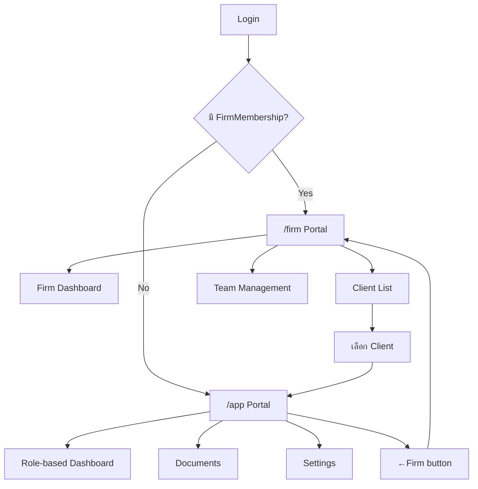
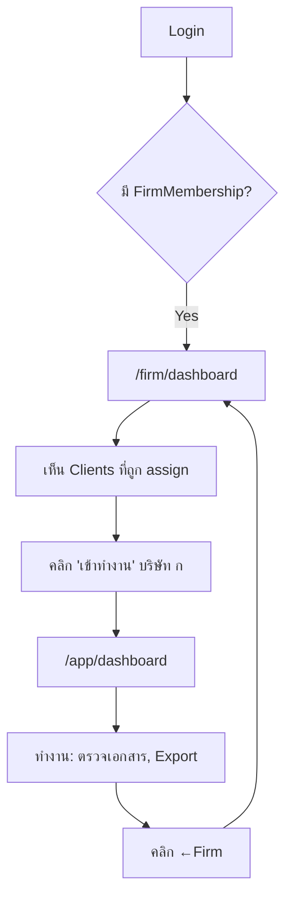
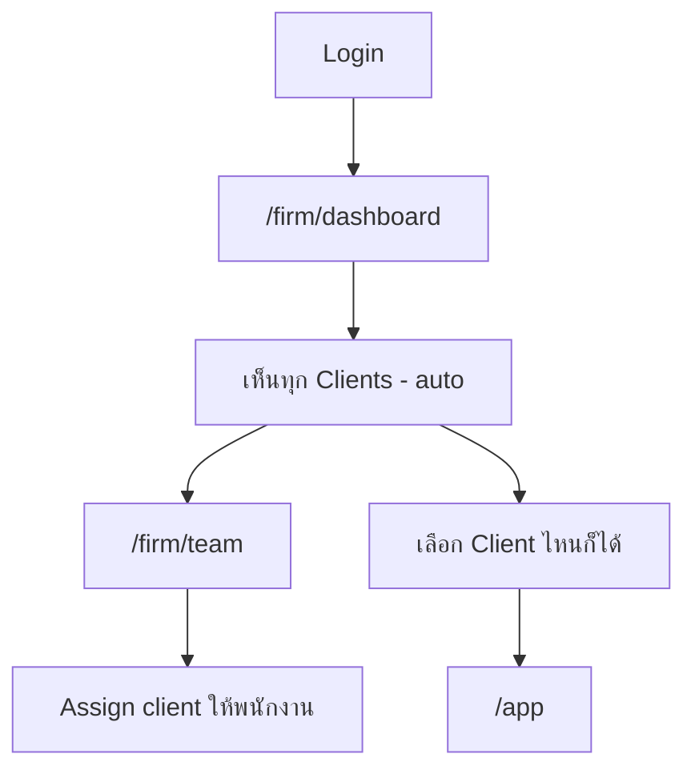
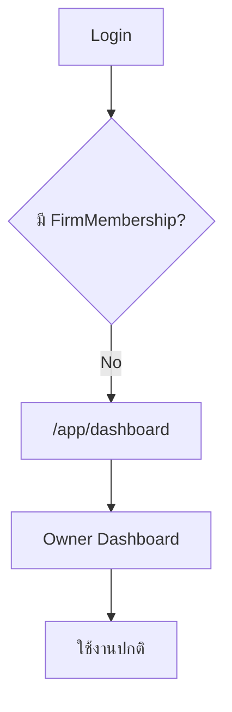
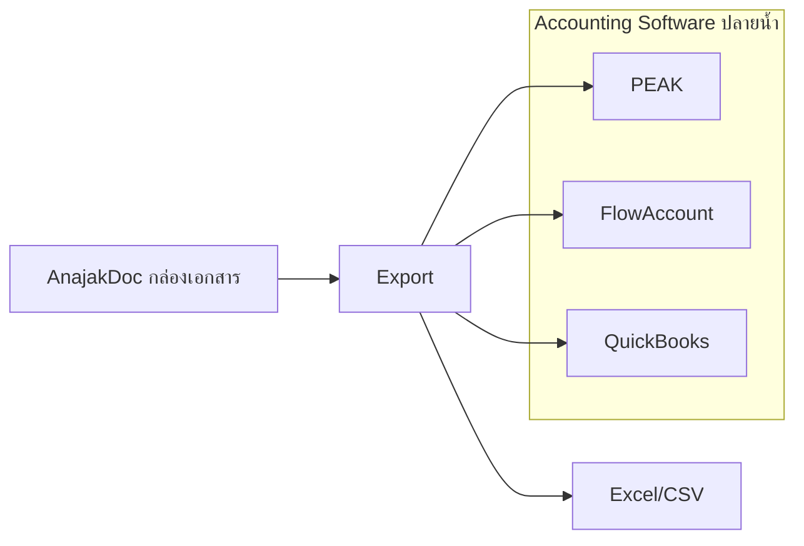

# Full UX/UI Redesign - กล่องจัดการเอกสารดิจิตอล

## Core Value Proposition (ห้ามลืม!)

```
🎯 AnajakDoc = กล่องจัดการเอกสารดิจิตอล
   ไม่ใช่ = แอปบัญชี
```

### เราทำ (In Scope)

- รับเอกสาร (upload, scan, OCR)
- จัดหมวดหมู่ (categorize, tag, contact)
- ติดตามสถานะ (workflow)
- ส่งต่อไปบัญชี (export to accounting software)
- เก็บรักษา (archive)
- แจ้งเตือนเอกสารค้าง

### เราไม่ทำ (Out of Scope)

- General Ledger / Journal entries
- งบการเงิน (Financial Statements)
- Bank Reconciliation
- Payroll
- Inventory Management
- Financial Analytics / P&L Reports

---

## Summary

แยกระบบเป็น 2 Portals:

- `/firm` - สำหรับสำนักบัญชี (Firm Portal)
- `/app` - สำหรับธุรกิจ/ทำงานใน Client (Organization Portal)

## Business Model: Hybrid Pricing

```
SME Plans (Organization จ่ายเอง):
├── Free     : 20 docs/month, 1 user
├── Starter  : ฿299/month - unlimited docs, 3 users
└── Business : ฿599/month - reports, export, 10 users

Firm Add-on (Firm จ่ายเพิ่ม):
├── Firm Starter : ฿990/month - dashboard, 10 members
└── Firm Pro     : ฿2,500/month - white-label, unlimited
```

**Key Principle:** SME เป็นเจ้าของ account เสมอ ไม่ถูก lock กับ Firm

---

## Architecture Overview



---

## Current Problems

1. **Navigation Overload** - 15+ menu items ทำให้ผู้ใช้สับสน
2. **One-size-fits-all Dashboard** - ไม่ได้ optimize ตาม role
3. **Context Switching** - สำนักบัญชีต้องสลับ Firm/Client view ตลอด
4. **No Clear Hierarchy** - ไม่รู้ว่าควรทำอะไรก่อน
5. **No Client Assignment** - พนักงานสำนักบัญชีเห็นทุก clients

---

## Phase 0: Database Schema Updates

### New Models Required

```prisma
// Client Assignment - กำหนดว่าพนักงานคนไหนดูแล client ไหน
model FirmClientAssignment {
  id             String   @id @default(cuid())
  firmId         String
  organizationId String   // Client
  userId         String   // Firm Member
  role           AssignmentRole @default(PRIMARY)
  createdAt      DateTime @default(now())
  
  firm           AccountingFirm @relation(...)
  organization   Organization   @relation(...)
  user           User           @relation(...)
  
  @@unique([firmId, organizationId, userId])
}

enum AssignmentRole {
  PRIMARY    // รับผิดชอบหลัก
  SUPPORT    // ช่วยเสริม
}

// Update Organization to ensure SME ownership
model Organization {
  // ... existing fields ...
  plan         OrgPlan  @default(FREE)
  billingEmail String?
  
  // Firm relationship (optional - SME can exist without Firm)
  firmId       String?
  firm         AccountingFirm? @relation(...)
  
  // Client assignments
  firmAssignments FirmClientAssignment[]
}

enum OrgPlan {
  FREE
  STARTER
  BUSINESS
}

// Update AccountingFirm
model AccountingFirm {
  // ... existing fields ...
  plan         FirmPlan @default(STARTER)
  
  // Client assignments
  clientAssignments FirmClientAssignment[]
}

enum FirmPlan {
  STARTER    // 990/mo - 10 members
  PRO        // 2500/mo - unlimited, white-label
}
```

### Files to Modify

- [prisma/schema.prisma](prisma/schema.prisma)
- Run: `npx prisma migrate dev --name add_client_assignment`

---

## Phase 1: Dual Portal Architecture

### Route Structure

```
src/app/
├── (firm)/                    ← NEW: Firm Portal
│   ├── layout.tsx             ← Firm-specific layout
│   ├── page.tsx               ← Redirect to /firm/dashboard
│   ├── dashboard/
│   │   └── page.tsx           ← Firm Dashboard
│   ├── clients/
│   │   └── page.tsx           ← Client List
│   ├── team/
│   │   └── page.tsx           ← Team + Assignment
│   └── settings/
│       └── page.tsx           ← Firm Settings
│
├── (app)/                     ← EXISTING: Organization Portal
│   ├── layout.tsx             ← Updated with ←Firm button
│   ├── dashboard/
│   │   └── page.tsx           ← Role-based dashboard
│   ├── documents/
│   └── settings/
│
├── (auth)/                    ← EXISTING: Auth pages
└── api/
```

### Auth Redirect Logic

```typescript
// middleware.ts or auth redirect
async function getPostLoginRedirect(session: Session) {
  // Check if user has FirmMembership
  if (session.user.firmMembership) {
    return '/firm/dashboard';
  }
  
  // Otherwise go to app
  return '/app/dashboard';
}
```

---

## Phase 2: Firm Portal (/firm)

### Firm Layout Structure

```
┌─────────────────────────────────────────────────────────────────┐
│ [Logo]  สำนักบัญชี ABC                    🔔  [สมชาย ▼]         │
├───────────────┬─────────────────────────────────────────────────┤
│               │                                                 │
│  OVERVIEW     │  {Page Content}                                │
│  [Dashboard]  │                                                 │
│  [Clients]    │                                                 │
│               │                                                 │
│  MANAGE       │                                                 │
│  [Team]       │                                                 │
│  [Calendar]   │                                                 │
│               │                                                 │
│  SETTINGS     │                                                 │
│  [Firm]       │                                                 │
│               │                                                 │
└───────────────┴─────────────────────────────────────────────────┘
```

### /firm/dashboard - Firm Dashboard

```
+--------------------------------------------------+
| 📋 เอกสารรอดำเนินการ                  [+ Client] |
+--------------------------------------------------+
| สถิติรวม                                         |
| [12 Clients] [45 เอกสารค้าง] [8 ใกล้ deadline]   |
+--------------------------------------------------+
| 📁 Clients ที่ฉันดูแล           [Grid/List 📋📊] |
| +----------+ +----------+ +----------+           |
| |บริษัท ก  | |บริษัท ข  | |บริษัท ค  |           |
| |3 เอกสาร  | |7 เอกสาร  | |12 เอกสาร | ⚠️        |
| |รอดำเนินการ| |รอดำเนินการ| |รอดำเนินการ|          |
| |[เข้าทำงาน]| |[เข้าทำงาน]| |[เข้าทำงาน]|          |
| +----------+ +----------+ +----------+           |
+--------------------------------------------------+
| 📅 เอกสารใกล้ Deadline                           |
| • เอกสาร VAT - บริษัท ก, ข (ส่งภายใน 25 ม.ค.)   |
| • เอกสาร WHT - บริษัท ค (ส่งภายใน 31 ม.ค.)      |
+--------------------------------------------------+
```

**หมายเหตุ:** ไม่มี Health Score หรือ Financial Metrics (เกินขอบเขต Document Management)

**Visibility Rules:**

- OWNER/ADMIN: เห็นทุก clients
- ACCOUNTANT/STAFF: เห็นเฉพาะ clients ที่ถูก assign

### /firm/team - Team & Client Assignment

```
+------------------------------------------------------------------+
| 👥 จัดการทีม                                    [+ เชิญสมาชิก]   |
+------------------------------------------------------------------+
|                                                                   |
| สมาชิก                              Clients ที่ดูแล              |
| ┌───────────────────────────────────────────────────────────────┐|
| │ 👤 สมชาย (OWNER)                  [ทุก Clients - auto]        │|
| ├───────────────────────────────────────────────────────────────┤|
| │ 👤 สมหญิง (ADMIN)                 [ทุก Clients - auto]        │|
| ├───────────────────────────────────────────────────────────────┤|
| │ 👤 นักบัญชี A (ACCOUNTANT)                                    │|
| │     บริษัท ก (PRIMARY), บริษัท ข (SUPPORT)                    │|
| │     [+ Assign Client] [แก้ไข]                                 │|
| ├───────────────────────────────────────────────────────────────┤|
| │ 👤 นักบัญชี B (ACCOUNTANT)                                    │|
| │     บริษัท ค (PRIMARY), บริษัท ง (PRIMARY)                    │|
| │     [+ Assign Client] [แก้ไข]                                 │|
| └───────────────────────────────────────────────────────────────┘|
+------------------------------------------------------------------+
```

### /firm/settings - Firm Settings

```
+------------------------------------------------------------------+
| ⚙️ ตั้งค่าสำนักงาน                                               |
+------------------------------------------------------------------+
|                                                                   |
| ข้อมูลทั่วไป                                                     |
| ├── ชื่อสำนักงาน: [ABC Accounting_________]                      |
| ├── โลโก้: [อัพโหลด]                                             |
| └── ที่อยู่/เบอร์โทร                                             |
|                                                                   |
| Branding (Pro Plan Only)                                         |
| ├── สีหลัก: [#1a73e8]                                            |
| ├── Footer text: [___________]                                   |
| └── Custom domain: [_________.anajakdoc.com]                     |
|                                                                   |
| Subscription                                                      |
| ├── Plan: Firm Starter (฿990/เดือน)                             |
| ├── Members: 5/10                                                |
| └── [Upgrade to Pro]                                             |
+------------------------------------------------------------------+
```

---

## Phase 3: App Portal (/app) - Role-based Dashboards

### App Layout with Back-to-Firm Button

```
┌─────────────────────────────────────────────────────────────────┐
│ [←Firm]  บริษัท ก                        🔔  [สมชาย ▼]         │
│ (แสดงเฉพาะ FirmMember)                                         │
├───────────────┬─────────────────────────────────────────────────┤
│               │                                                 │
│  MAIN         │  {Role-based Dashboard}                        │
│  [Dashboard]  │                                                 │
│  [Documents]  │                                                 │
│  [Search]     │                                                 │
│               │                                                 │
│  ACCOUNTING   │  (If ACCOUNTING+)                              │
│  [WHT]        │                                                 │
│  [Reports]    │                                                 │
│  [Export]     │                                                 │
│               │                                                 │
│  SETTINGS     │  (If ADMIN+)                                   │
│  [Org]        │                                                 │
│  [Members]    │                                                 │
│               │                                                 │
│  [ + Create ] │                                                 │
└───────────────┴─────────────────────────────────────────────────┘
```

### Owner Dashboard (ผู้ประกอบการ)

```
+--------------------------------------------------+
| สวัสดี, [Name]                   [+ สร้างกล่อง]  |
+--------------------------------------------------+
| 📋 สถานะเอกสาร                                   |
| รอดำเนินการ: 5    กำลังตรวจ: 3    เสร็จแล้ว: 42 |
+--------------------------------------------------+
| ⚠️ ต้องการความสนใจ                    [ดูทั้งหมด] |
| • 3 เอกสารรออนุมัติ                              |
| • 2 รายการรอคืนเงินพนักงาน                       |
| • 1 เอกสาร WHT รอตรวจสอบ                        |
+--------------------------------------------------+
| 🕒 กิจกรรมล่าสุด                                  |
| • Invoice #123 ส่งโดย John                       |
| • Receipt ตรวจแล้วโดย ฝ่ายบัญชี                  |
+--------------------------------------------------+
```

**หมายเหตุ:** ไม่มี Financial Summary (รายรับ/รายจ่าย) - เกินขอบเขต Document Management

### Document Processor Dashboard (ผู้ตรวจเอกสาร/บัญชี)

```
+--------------------------------------------------+
| 📋 เอกสารรอดำเนินการ            [+ สร้างกล่อง]   |
+--------------------------------------------------+
| +----------+ +----------+ +----------+           |
| | รอตรวจ   | | กำลังตรวจ| |พร้อมส่งบัญชี|        |
| |    12    | |    5     | |    8     |           |
| +----------+ +----------+ +----------+           |
+--------------------------------------------------+
| งานวันนี้                                        |
| [ ] ตรวจ Invoice #456 (2h ago)                  |
| [ ] จัดการเอกสาร WHT Vendor A                   |
| [ ] Export เอกสารประจำเดือน                      |
+--------------------------------------------------+
| ⚠️ เอกสารค้างนาน                                 |
| 3 เอกสารค้าง > 7 วัน                            |
+--------------------------------------------------+
```

### Staff Dashboard (พนักงานทั่วไป)

```
+--------------------------------------------------+
| [ + อัพโหลดเอกสาร ]                              |
+--------------------------------------------------+
| 📁 เอกสารของฉัน                                  |
| +----------------------------------------+      |
| | Draft (2)  | รอตรวจ (3) | เสร็จแล้ว (15)|     |
| +----------------------------------------+      |
+--------------------------------------------------+
| ⚡ Quick Actions                                 |
| [ค่าใช้จ่าย] [ใบเสร็จ] [สแกนเอกสาร]             |
+--------------------------------------------------+
| 💰 เบิกคืนของฉัน                                 |
| รอดำเนินการ: ฿3,500    อนุมัติแล้ว: ฿12,000     |
+--------------------------------------------------+
```

---

## User Flows

### Flow 1: พนักงานสำนักบัญชี (ACCOUNTANT)



### Flow 2: Firm Owner/Admin



### Flow 3: เจ้าของธุรกิจ (ไม่มี Firm)



---

## Files to Create/Modify

### NEW: Firm Portal

```
src/app/(firm)/
├── layout.tsx                    ← Firm layout with sidebar
├── page.tsx                      ← Redirect to /firm/dashboard
├── dashboard/
│   └── page.tsx                  ← FirmDashboard component
├── clients/
│   └── page.tsx                  ← ClientList component
├── team/
│   └── page.tsx                  ← TeamManagement + ClientAssignment
└── settings/
    └── page.tsx                  ← FirmSettings component
```

### NEW: Components

```
src/components/
├── firm/                         ← NEW folder
│   ├── firm-sidebar.tsx          ← Firm navigation
│   ├── client-card.tsx           ← Client card with health score
│   ├── client-list.tsx           ← Grid/List of clients
│   ├── team-list.tsx             ← Team members
│   └── assignment-dialog.tsx     ← Client assignment modal
│
├── dashboard/                    ← NEW folder
│   ├── owner-dashboard.tsx
│   ├── accountant-dashboard.tsx
│   └── staff-dashboard.tsx
│
└── layout/
    ├── command-search.tsx        ← NEW: Global search (Cmd+K)
    └── back-to-firm.tsx          ← NEW: ←Firm button
```

### MODIFY: Existing Files

| File | Changes |

|------|---------|

| [prisma/schema.prisma](prisma/schema.prisma) | Add FirmClientAssignment, Plan enums |

| [src/middleware.ts](src/middleware.ts) | Add /firm routes to protected paths |

| [src/server/auth.ts](src/server/auth.ts) | Add firmAssignments to session |

| [src/app/(app)/layout.tsx](src/app/\\\\\\\\\\(app)/layout.tsx) | Add ←Firm button for FirmMembers |

| [src/app/(app)/dashboard/page.tsx](src/app/\\\\\\\\\\(app)/dashboard/page.tsx) | Route to role-based dashboard |

| [src/types/index.ts](src/types/index.ts) | Add Firm types |

### NEW: Server Actions

```
src/server/actions/firm/
├── index.ts
├── query.ts              ← Get firm, clients, members
├── assignment.ts         ← Assign/unassign clients
└── settings.ts           ← Update firm settings
```

---

## Visual Design System - Teal Theme

### Color Palette

#### Light Mode

```css
/* Primary */
--primary:          #0F766E;  /* Teal 700 */
--primary-hover:    #0D9488;  /* Teal 600 */
--primary-light:    #CCFBF1;  /* Teal 100 */

/* Background */
--bg-base:          #FFFFFF;
--bg-subtle:        #F8FAFC;  /* Slate 50 */
--bg-muted:         #F1F5F9;  /* Slate 100 */

/* Text */
--text-primary:     #0F172A;  /* Slate 900 */
--text-secondary:   #64748B;  /* Slate 500 */
--text-muted:       #94A3B8;  /* Slate 400 */

/* Border */
--border:           #E2E8F0;  /* Slate 200 */
--border-strong:    #CBD5E1;  /* Slate 300 */

/* Status */
--success:          #22C55E;  /* Green 500 */
--warning:          #F59E0B;  /* Amber 500 */
--error:            #EF4444;  /* Red 500 */
--info:             #3B82F6;  /* Blue 500 */
```

#### Dark Mode

```css
/* Primary */
--primary:          #2DD4BF;  /* Teal 400 */
--primary-hover:    #5EEAD4;  /* Teal 300 */
--primary-light:    #134E4A;  /* Teal 900 */

/* Background */
--bg-base:          #0F172A;  /* Slate 900 */
--bg-subtle:        #1E293B;  /* Slate 800 */
--bg-muted:         #334155;  /* Slate 700 */

/* Text */
--text-primary:     #F8FAFC;  /* Slate 50 */
--text-secondary:   #94A3B8;  /* Slate 400 */
--text-muted:       #64748B;  /* Slate 500 */

/* Border */
--border:           #334155;  /* Slate 700 */
--border-strong:    #475569;  /* Slate 600 */

/* Status (slightly adjusted for dark) */
--success:          #4ADE80;  /* Green 400 */
--warning:          #FBBF24;  /* Amber 400 */
--error:            #F87171;  /* Red 400 */
--info:             #60A5FA;  /* Blue 400 */
```

### Typography

```css
/* Font Family */
font-family: 'Inter', -apple-system, BlinkMacSystemFont, sans-serif;

/* Font Weights */
--font-normal:      400;
--font-medium:      500;
--font-semibold:    600;
--font-bold:        700;

/* Font Sizes */
--text-xs:          12px;   /* Small labels */
--text-sm:          14px;   /* Body small */
--text-base:        16px;   /* Body */
--text-lg:          18px;   /* H4 */
--text-xl:          20px;   /* H3 */
--text-2xl:         24px;   /* H2 */
--text-3xl:         30px;   /* H1 */

/* Line Heights */
--leading-tight:    1.25;
--leading-normal:   1.5;
--leading-relaxed:  1.625;
```

### Spacing Scale

```css
--space-0:    0;
--space-1:    4px;
--space-2:    8px;
--space-3:    12px;
--space-4:    16px;
--space-5:    20px;
--space-6:    24px;
--space-8:    32px;
--space-10:   40px;
--space-12:   48px;
--space-16:   64px;
```

### Border Radius

```css
--radius-sm:    4px;   /* Buttons small */
--radius-md:    6px;   /* Inputs, buttons */
--radius-lg:    8px;   /* Cards */
--radius-xl:    12px;  /* Modals */
--radius-full:  9999px; /* Pills, avatars */
```

### Shadows

```css
/* Light Mode */
--shadow-sm:    0 1px 2px rgba(0, 0, 0, 0.05);
--shadow-md:    0 4px 6px -1px rgba(0, 0, 0, 0.1);
--shadow-lg:    0 10px 15px -3px rgba(0, 0, 0, 0.1);
--shadow-xl:    0 20px 25px -5px rgba(0, 0, 0, 0.1);

/* Dark Mode */
--shadow-sm:    0 1px 2px rgba(0, 0, 0, 0.3);
--shadow-md:    0 4px 6px -1px rgba(0, 0, 0, 0.4);
--shadow-lg:    0 10px 15px -3px rgba(0, 0, 0, 0.4);
--shadow-xl:    0 20px 25px -5px rgba(0, 0, 0, 0.4);
```

### Component Styling

#### Buttons

```css
/* Primary Button */
.btn-primary {
  background: var(--primary);
  color: white;
  padding: 10px 16px;
  border-radius: var(--radius-md);
  font-weight: var(--font-medium);
  transition: all 0.15s ease;
}

.btn-primary:hover {
  background: var(--primary-hover);
}

/* Secondary Button */
.btn-secondary {
  background: transparent;
  color: var(--text-primary);
  border: 1px solid var(--border);
}
```

#### Cards

```css
.card {
  background: var(--bg-base);
  border: 1px solid var(--border);
  border-radius: var(--radius-lg);
  padding: var(--space-6);
  box-shadow: var(--shadow-sm);
}
```

#### Inputs

```css
.input {
  background: var(--bg-base);
  border: 1px solid var(--border);
  border-radius: var(--radius-md);
  padding: 10px 12px;
  font-size: var(--text-sm);
}

.input:focus {
  border-color: var(--primary);
  outline: none;
  box-shadow: 0 0 0 3px var(--primary-light);
}
```

### Status Colors Usage

| Status | Light Mode | Dark Mode | ใช้สำหรับ |

|--------|------------|-----------|----------|

| Success | #22C55E | #4ADE80 | เสร็จสมบูรณ์, อนุมัติ |

| Warning | #F59E0B | #FBBF24 | รอดำเนินการ, ใกล้ deadline |

| Error | #EF4444 | #F87171 | ผิดพลาด, ค้างนาน |

| Info | #3B82F6 | #60A5FA | ข้อมูล, แจ้งเตือน |

| Primary | #0F766E | #2DD4BF | Actions, links |

---

## Mobile Experience

### Bottom Navigation (5 items max)

```
+------------------------------------------+
|  Home  |  Docs  | [+] | Tasks | Profile  |
+------------------------------------------+
```

### Mobile-specific

- Swipe gestures for document status
- Pull-to-refresh
- Bottom sheets instead of modals
- Thumb-zone optimized buttons

---

## Implementation Summary

| Phase | งาน | ไฟล์หลัก |

|-------|-----|---------|

| 0 | Database Schema | prisma/schema.prisma |

| 1 | Dual Portal Setup | (firm)/layout.tsx, middleware.ts |

| 2 | Firm Portal Pages | /firm/dashboard, /firm/team |

| 3 | App Dashboards | dashboard components |

| 4 | Page Optimization | documents, settings |

| 5 | Polish | animations, mobile |

---

## Naming Changes (ปรับให้ตรง Core Value)

| เดิม | ใหม่ | เหตุผล |

|------|------|--------|

| Reports | Document Analytics | ไม่ใช่ Financial Reports |

| WHT Tracking | เอกสาร WHT รอนำส่ง | เป็น document tracking ไม่ใช่ tax management |

| Ready to Book | พร้อมส่งบัญชี | ชัดว่าเราส่งต่อไป accounting software |

| Accountant Dashboard | Document Processor View | ไม่ใช่แอปบัญชี |

| Health Score | ❌ ตัดออก | เกินขอบเขต document management |

| Benchmarking | ❌ ตัดออก | เกินขอบเขต document management |

| Financial Summary | ❌ ตัดออก | เกินขอบเขต document management |

---

## Key Decisions Made

1. **Dual Portal Architecture** - แยก /firm และ /app ชัดเจน
2. **Hybrid Pricing** - SME เป็นเจ้าของ, Firm จ่าย add-on
3. **Client Assignment** - พนักงานเห็นเฉพาะ clients ที่ถูก assign
4. **No Lock-in** - SME ใช้ได้แม้ไม่มี Firm
5. **Document-First** - ทุก feature ต้องเกี่ยวกับ document management
6. **Export to Accounting** - เราเป็นต้นน้ำ ส่งไปปลายน้ำ (accounting software)

---

## Export Integration (จุดขายสำคัญ)



**Key Message:** AnajakDoc = ต้นน้ำ → ส่งเอกสารไป → Accounting Software (ปลายน้ำ)